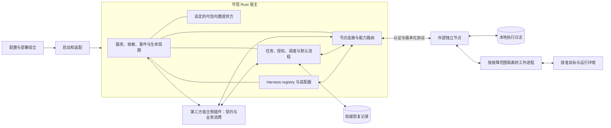

# Recuvora 架构设计

**Harness 提供方统一位于独立节点。** 宿主只编译供应商中立的 `remote-node` 代理，不包含提供方进程、凭据或私有协议实现。

> 状态：完整自愈系统的目标设计，其中已实现最小通用框架、持久模拟任务引擎、CLI、多 Harness registry、外部 Harness 节点接入，以及 Web/Tauri Desktop 共用资产的官方 UI、可信 HTTP API、JSONL 节点代理、受限只读第三方插件加载和宿主渲染的声明式插件监控专页。`repair` 已接通独立执行/审批会话、持久授权与白名单文件替换；共享 UI 默认连接可信 API，演示模式需显式选择且写操作禁用；模拟引擎保持封闭。其他本机平台、目标专属外部动作、直接网络 Harness 适配器、原生命令与发布、通用远程写授权和自动节点恢复仍未实现。当前范围见 [项目 README](../README.md) 和 [审批说明](approval.md)，能力装配与生命周期见 [插件设计](plugins.md)，源码导航见 [模块说明](../src/README.md)。

## 目标与运行边界

Recuvora 持续消费异构目标与工作负载的提供方观测，将故障证据交给指定 AI Harness，在有效授权内处理获准目标，经独立业务验证后保存可复用经验。宿主支持范围由通用契约、平台实现和自动验证共同界定。

采用 Rust 可信宿主、按配置组合的内置业务模块，以及按故障范围隔离的外部能力。服务契约、依赖、事件和生命周期决定能力如何组合，进程位置不定义插件身份。插件框架与自愈业务分开：默认自愈流程本身可作为业务模块注册和选择。

内置模块随宿主共同编译发布，配置只能选择已编入的实现；新增代码需要更新宿主。需要独立安装的扩展默认进程外。首版不将任意 Rust 原生动态库加载作为通用第三方扩展方式，也不对其他第三方插件包或 API 提供隐式兼容承诺。

宿主产品不提供节点程序或节点构建角色。Harness、日志采集等节点由独立项目维护；新的业务契约、schema、消费和验证逻辑可由第三方宿主侧插件提供。宿主侧是逻辑角色，独立插件默认进程外；在通用扩展机制可表达的范围内，新增业务不要求修改或重新编译宿主核心。宿主保留注册、连接、路由、兼容和限额等公共机制，任务授权及权威记录由明确的可信服务保障。完整开发边界见 [插件设计](plugins.md)。外部接入已实现 [协议文档](extension-protocol.md) 限定的只读插件和 Harness 能力；完整生命周期与远程恢复仍按本设计演进。

产品运行期间，修复 AI 只修改获准的目标项目、配置、素材和隔离副本，不得改写 Recuvora、插件包、启用配置或自身更新机制。贡献者通过正常开发与发布流程维护本项目。

## 职责与模块组织

项目采用单个 Cargo 包 `recuvora`，根 `Cargo.toml` 统一管理依赖、库、可执行程序和测试目标。源码按能力集中在 `src/`；领域包含契约、提供方和相关消费者，通过模块和可见性维护边界。`src/lib.rs` 导出已实现的 `framework`、`recovery`、`monitors`、`boot`、`harnesses`、`interfaces`、`actions`、`nodes` 和 `protocol` 模块，`server` 按 feature 编译；`src/main.rs` 调用 CLI 启动模块，`src/bin/recuvora-desktop.rs` 调用 Tauri 薄启动。其他能力目录仍只保留规划文档。模块不自动等于插件或运行进程；各能力的实现和验收分开记录在[状态表](implementation-status.md)。

| 目录 | 职责 |
| --- | --- |
| `src/framework/` | 通用上下文、服务注册、依赖管理、事件、实例生命周期、资源清理与运行后端接口；不包含目标专属、自愈或授权业务 |
| `src/recovery/` | 封闭模拟引擎、独立持久审批与受限修复流程；完整任务调度和自愈业务规划 |
| `src/boot/`、`profiles/` | CLI 与 Tauri 薄启动、配置校验及提供方选择；profiles 提供 Harness 与受限修复的外部配置示例，完整部署组合仍在规划 |
| `src/nodes/` | 宿主侧节点登记、身份与会话、能力发现、调用路由和执行事实核对；不包含节点程序 |
| `src/protocol/`、`src/sdk/` | 跨进程与跨节点协议及代理映射；插件开发接口复用，不集中收纳所有领域服务定义 |
| `src/monitors/`、`src/harnesses/` | 通用只读监控、规则及覆盖判定；多 Harness 实例、节点工作区、独立审批角色及受控宿主工具路由 |
| `src/platforms/`、`src/vision/` | 桌面与视觉能力的宿主契约、消费及代理边界规划；各平台目录记录接入约束，具体节点后端由外部项目实现 |
| `src/actions/`、`src/knowledge/` | Windows 受限文本动作；其他目标操作、发布、业务验证及经验管理规划 |
| `src/interfaces/`、`src/server/` | CLI 交互、Web/Desktop 官方页面与版本化 HTTP API；人工审批由可信服务核验身份、权限和权威版本 |
| `src/notifications/` | 通知渠道、投递结果与重试规则规划 |

项目根、`src/`、能力目录、平台子目录、`profiles/`、`docs/`、`tests/` 与 `scripts/` 维护 README 和 AGENTS。`docs/` 保存共同设计，测试统一放在 `tests/`，脚本有实际需要时才放入 `scripts/`。安装产物、真实配置、凭据和运行数据与源码分开管理。

真实 CLI 与 HTTP 共用 `boot::host::HostRuntime`：按扩展→Harness→消费绑定的依赖发布 framework 服务，统一配置加载、工厂选择及关闭。通用取消与在途调用跟踪位于 framework，协议和节点不依赖 Harness 类型。关闭先拒绝新派发，再等待实际提供方结束；排空超时不报告为干净退出。当前只统一这些提供方的装配，模拟引擎和审批存储仍各自维护业务权威，不声称完整任务调度已经融合。

`recovery::workflow` 输出类型化 `RepairResult`，CLI 与 HTTP 经交互层转换为共同 JSON。审批的存储、路径及状态迁移是同一服务的私有子模块；拆分不改变许可、持久日志格式和业务授权边界。

### 共享前端与发布边界

官方 UI 是完整标准控制台，其基础壳包含统一监控/故障中心、通用管理以及 Harness 会话、修复详情、日志查询和模拟实验室等标准业务页面。页面由本项目统一维护和交付，不要求单独安装业务 UI 插件。业务执行或数据处理可位于后台插件与独立节点，官方页面经统一版本化服务契约读取状态和提交请求；后端扩展边界不决定前端页面的归属。

每个配置的业务插件另有宿主管理的监控专页，用于把通用监控与插件语义放在同一页面查看。宿主始终提供连接、监控、发现和覆盖状态；插件只能用现有只读契约登记严格有界的 `sections`、`monitor_role` 与 `fields` 声明，字段值由宿主 `MonitorSnapshot` 及 `last_value` 提供。浏览器不直连插件，官方渲染器不提供或解释插件 HTML、JavaScript、CSS、Markdown、URL 或动作，所有声明字符串只作为纯文本。缺少声明、兼容提供方或权限时，专页降级到通用宿主数据，不虚构数据或动作成功。官方 UI 可选交付，宿主核心不以页面存活为运行前提；关闭客户端不应停止独立运行的后台任务。完整注册与权限约束见[插件设计](plugins.md#官方-ui-与插件监控专页)。

`src/interfaces/ui/public/` 是唯一前端资产源，包含浏览器与 Tauri 窗口共同使用的页面、路由、样式和演示数据。Web 构建将这些文件复制到项目外的内容标识目录；Desktop 由同一 Cargo 包中 feature 限定的 `recuvora-desktop` 二进制嵌入同一目录。载体差异只用于窗口/浏览器环境元数据，不形成第二套界面、业务功能或授权语义。

根 manifest 的 `cli`、`server`、`web-ui`、`desktop-ui` 和 `all-ui` 只表达编译组合；`desktop-ui` 引入 Tauri 并包含共享 Web UI 能力。`scripts/build-ui.ps1` 公开 `Web`、`Desktop`、`All` 三个前端目标：前者生成静态目录，中者生成 Desktop 程序，后者同时返回两类产物。仅构建静态资产不托管文件；可选 server 的 serve 入口提供 HTTP API，与 web-ui 同启时托管共享页面。feature 不代替实际能力和权限校验。静态输出、资产清单、Cargo target 和 Desktop 程序一律位于项目目录之外。

当前两种载体共用 HTTP 客户端，默认显示真实模式的连接状态和权威数据；只有显式演示模式使用演示数据且禁用写操作。后端令牌和配置权限约束提交，审批服务核验版本后产生真实决定和许可；前端不能制造授权。连接丢失、过期视图、超时与 Unknown 均显式展示，不自动重放。Tauri 壳不复制业务状态机，API 详情见 [控制台说明](console-api.md)。

共享静态资产的构建输出与 Tauri ACL/schema 均位于项目外。Tauri 构建辅助在 Cargo `OUT_DIR` 暂存所需 manifest 和配置，`generate_context!` 仍嵌入原始共享资产；这不产生第二个源码包或前端。构建流程和 CI 见[脚本文档](../scripts/README.md)。

## 运行与信任边界

| 部分 | 默认运行方式 | 故障与更新范围 |
| --- | --- | --- |
| 框架、任务、授权、恢复日志、调度与默认流程 | 可信 Rust 宿主内，通过服务契约组合 | 共享地址空间与故障范围，随宿主发布；关键服务受控停机和恢复 |
| Web 静态 UI 与 Tauri Desktop 壳 | 浏览器托管目录或本机 WebView；共用可信 HTTP API | 共用静态资产与客户端；授权由服务端核验，窗口/页面状态不属于权威运行状态 |
| 简单可信监控、知识或通知实现 | 经依赖与风险评估后可内置 | 无强隔离保证；阻塞、资源耗尽或严重故障可能影响宿主 |
| 外部 Harness 节点 | 宿主经 `remote-node` 和受监督 stdio/SSH stdio 调用独立程序 | 节点管理提供方协议与进程；执行会话只路由宿主显式注册的工具，审批会话无工具；断连不代表外部动作已回滚 |
| 桌面原生接口、截图输入、视觉及复杂运行时 | 受监督的工作进程 | 按信任、会话、资源和故障范围划分；多个可信能力可共享进程 |
| 第三方及需要独立安装的扩展 | 默认进程外 | 独立版本、协议兼容检查、限额及受控升级；失效时收回对应能力 |
| 宿主侧业务插件与外部节点 | 分别由独立项目发布，经认证和契约匹配接入 | 插件扩充业务契约和消费逻辑，节点提供具体能力；两者均不要求重新构建宿主来加入普通新业务 |

可信宿主和关键业务优先安全 Rust，不为分层额外引入 Go。Python 仅用于确有依赖需要的视觉或其他外部能力，关键恢复不依赖 Python 进程存活。同进程服务调用不强制序列化；远程提供方通过代理接入相同业务契约，但显式保留超时、取消、断连及未知结果。

图中所有 Harness 与其他外部能力都经节点网关接入；完整自动恢复和生产进程监督仍待完善。节点可与宿主部署在同一机器，但保持独立程序和发行边界，连接时核验双方身份及被分配范围。业务插件与节点通过已注册契约对接，不直接访问宿主内部 Rust 类型；插件可以组合多个节点的能力。节点记录执行事实并与权威记录对账，不成为第二套任务或授权权威。节点可以上报能力摘要，但没有匹配消费者插件的负载不能直接进入业务流程。

进程隔离限制部分故障传播，不是权限沙箱。同进程模块属于宿主信任边界；运行身份、文件权限、凭据范围和所选平台隔离机制负责落实外部执行限制。系统服务管理机制监督宿主自身退出，宿主运行后端监督自己启动的插件工作进程，外部节点监督其本机工作进程及子进程；不能依赖已经退出的程序自救，也不能以断线证明远端执行者已经停止。

## 服务装配与生命周期

通用监控引擎作为 `boot::host` 中依赖扩展注册表的框架服务运行。它将检查点和故障变化交给 `recovery::incidents` 原子持久化；故障分为目标异常与监控覆盖，确认收到不解除故障。节点只读轮询、有效期、重启与 UI 接口见[监控说明](monitoring.md)。监控快照保留实际 `extension_id` provider，HTTP 投影再按注册契约解析业务 `owner_plugin_id`；可选 `view_role` 仅影响插件专页如何选择展示数据，不改变采集、规则、检查点、故障或授权。该链路没有自动接通诊断和真实执行；模拟、审批和故障仍保持各自明确的业务权威。

- 业务消费者依赖领域服务契约，装配层选择内置或外部提供方。依赖缺失、循环、不兼容及同一作用域的提供方冲突必须在激活动作前报告。
- 框架只管理通用注册与生命周期；授权和恢复日志为何必需，由 recovery 的业务契约及 boot 的生产组合校验明确。
- 每个权威作用域只允许明确的任务、授权、调度和恢复记录提供者。持久服务初始化与恢复对账完成，授权服务可用，才能开放该作用域的执行能力。
- 关键服务失效时停止新派发并处理在途动作，保留暂停或未知状态；不能自动选择临时内存服务继续修复，也不能依赖知识库重建权威记录。
- 事件区分瞬时通知和持久事实。监听器、定时器、服务及资源按实例登记清理；生命周期 effect/dispose 不会自动撤销已发生的外部动作。
- 工作进程失效只收回其能力及受影响依赖；同进程严重故障可能终止宿主，必须通过持久恢复与外部监督处理。监控失联或证据过期表示覆盖缺失或状态未知，不表示目标健康。

### Harness 实例选择

Harness 只通过 `remote-node` 代理接入；节点工作区、宿主目标文件和审批工作区分别建模，节点在资源所在机器检查路径。双向工具经可信 handler 校验权限并记录事实。具体节点由独立项目交付，同机部署也保持独立进程和发布边界。

Harness 接入把“宿主支持哪类协议”和“当前配置哪些实例”分开。可信启动代码先注册已编入的适配器工厂；registry 配置再为每个实例指定稳定 `id`、`adapter`、`address`、启用状态和一个或多个 `workspace_roots`。同一适配器可以构造多个实例，默认实例必须显式配置；一次调用选择实例后，失败不会触发隐式跨实例重试。

`adapter` 不是可下载 SDK 名称，`address` 也不是代码或 shell 入口。两者只能选择并参数化宿主已经批准的适配器；未知适配器或不支持的地址在装配时拒绝。远端 `workspace_roots` 保存节点工作区 ID，调用必须显式选择其中之一；节点负责把资源映射到真实目录并检查范围。Harness 返回的线程、会话和文本继续携带实例关联，但它们不产生任务授权或完成事实。

节点工作区、客户端可见性、Harness 原生项目请求和独立客户端归组验证是四个独立维度。可见性由调用方选择 `Client` 或 `Hidden`；原生项目必须先向已经选定的 Harness 运行时探测，再明确选择该实例的已有项目或 `NoNativeProject`。后者只省略提供方原生 ID，独立客户端仍可能按自己的规则归组；项目 ID 不能跨 Harness 使用。新建原生项目是与文本轮次分开的持久操作，不代替调用方准备节点工作区；成功后再用返回 ID 发起原生项目请求。探测、读取、创建或原生请求失败都关闭失败，不冒充空列表，也不静默回退。创建或持久线程请求可能派发后遇到超时、取消或协议失败时返回结构化未知结果，保留幂等键或已知 thread/project ID。

通用外部节点契约通过能力声明和运行时响应提供文本、项目和工具功能；不支持的操作返回结构化不可用结果。宿主核验实例、节点、工作区、请求和响应关联，节点负责供应商协议、进程固定、工作目录保护及其客户端归组语义。原生项目 ID 不能独自证明另一个客户端已经归组；未经客户端独立观察时保持 `Unverified`。

调用方取消后，独立 supervisor 仍等待远端调用收尾再释放并发槽；已派发的持久操作不会因连接关闭而冒充为已撤销。无工具的 `harness` 文本路径保持原限制；受限修复通过显式注册的宿主工具路由接入持久审批，原生命令和提供方私有文件修改请求仍拒绝。`remote-node` 已通过独立 JSONL 程序或 SSH 命令接入，直接 HTTP/WebSocket 等网络适配器仍未实现。官方 UI 经可信 API 选择 Harness；真实跨机部署、完整任务调度及生产工作进程树监督仍待验收。

### 当前受限修复路径

`repair` 的独立外部配置指定执行 Harness、审批政策、目标根及文件白名单。`execution_harness` 与 `policy.reviewer.harness_id` 可以相同；两个角色始终使用独立 Hidden 会话，审批在独立目录中运行且无工具。适配器保留 4 个执行槽和 2 个专用审批槽，执行等待审批不会耗尽审批容量。当前文件动作仅支持 Windows 上不超过 16 KiB 的既有 UTF-8 文件全文替换，原生命令、发布、桌面输入和任意目标访问均不开放。

执行会话提出完整替换，宿主先核对文件和原内容、持久生成审批请求，再调用政策指定的人工或 Harness 审批者。可信 `ApprovalStore` 核验来源、请求、完整操作、政策范围和期限，记录决定；执行前再次检查并持久记录意图，发放一次使用的许可，之后由 `actions` 写入并核对文本。文件变化需要新请求，许可不能用于改动后的操作。审批不可用、证据不足或无法解析时转人工；执行开始后的不确定结果持久保留 `Unknown` 并阻断同一实际目标，不自动重放。

本地人工 CLI 提供查询、批准/拒绝、撤销、应用和未知结果核验，权限来自本地操作系统用户，不是远程身份认证服务。模拟任务引擎与这一路径分开，模拟授权不能使用真实动作。完整状态、配置与 CLI 用法见 [审批与受限修复](approval.md)。文本写后读回不证明目标业务已恢复。

## 任务状态与持久恢复

以下为完整自愈系统的领域状态语义。当前封闭模拟域的枚举、迁移、限额和退出恢复见 [模拟引擎](../src/recovery/README.md)，真实文件动作的独立审批状态见 [审批说明](approval.md)。两者不表示完整业务状态机已经实现。未来流程模块可以替换，授权、持久事实和验证条件仍受相同业务规则约束。

| 阶段 | 必须保存或核验的内容 |
| --- | --- |
| 发现与诊断 | 稳定事件及任务标识、故障证据、归并依据、环境版本与候选方案 |
| 等待授权 | 核验人工决定或受委托 Harness 的结构化评估、政策范围与请求版本；未获准前不执行相关副作用 |
| 就绪与执行 | 前置条件、目标版本、授权、互斥资源和执行意图；每次尝试独立标识 |
| 验证 | 目标实际状态、约定业务成功条件与外部副作用；模型声明不是完成证据 |
| 完成 | 权威服务接受验证结果后记录成功、失败或取消；经验沉淀单独跟踪 |
| 暂停或结果未知 | 依赖、权限、会话等不可用，或操作可能生效但无可靠回执；先核验再恢复 |

关键任务、授权和操作意图持久化后再确认或派发；执行端在副作用前记录意图，完成后记录结果并提交确认。外部操作与日志写入不是同一事务，不承诺端到端精确一次执行。

1. 重启后加载权威记录，与节点日志及实际目标状态对账；重新核验实例、会话、环境版本和授权后才恢复。
2. 可幂等操作使用稳定幂等键和前置条件。回执丢失、超时或工作进程退出时，不把“结果未知”当作“尚未执行”。
3. 同一目标的冲突操作互斥，桌面会话独占。执行边界验证任务版本及执行令牌，阻止旧实例继续操作。
4. 不可安全重复的外部动作先核验；无法确定时保持未知并转人工处理。
5. 停用、取消或租约到期不证明旧执行者已停止。确认进程及其子进程不能继续产生副作用后，才交还会话锁或授予新执行权。
6. 重试有次数、退避和总时长上限；持久写入失败时停止相关执行。证据和日志容量、备份及恢复必须单独验证。

## 授权与目标修改

已知方案仅在目标、版本、前置条件、验证规则和既有授权都匹配时自动执行。需要新决定时，可信政策选择人工或受委托的 Harness；未知问题、方案失效及范围变化不会继承旧许可，必须针对具体操作重新审批。超出委托范围、证据不足或审批不可用时等待人工。人工决定也不能扩大当前政策的硬性范围。

授权服务核验决定来源和请求标识，绑定任务版本、目标、完整操作、政策、有效期和资源范围。审批 Harness 的评估只有经可信宿主核验和持久接受后才能产生执行许可；界面声明、普通模型文本、知识及插件清单不产生权限。执行端在副作用发生前再次核验。授权撤销停止新派发，对已开始动作尽力取消并核实结果。CLI 的人工决定使用本地操作系统用户身份；HTTP 入口使用服务端配置的单操作员 Bearer 身份及权限。两种入口共用可信审批服务，多用户账户管理仍未实现。

目标变更优先在隔离副本或分支中进行，记录基线、差异和验证证据；发布须在授权覆盖范围内，回退也需明确适用条件并核验。源码、日志、画面和知识内容作为数据处理，不得据此扩大操作范围或修改 Recuvora。

## 目标变化后的适配闭环

1. 提供方观测发现既有流程失效，保存目标版本、环境版本、错误和有界证据。
2. 查询适用经验；未知或不确定问题提交政策指定的审批入口，超出委托范围时取得人工决定并重新配置有效范围。
3. 暂停冲突执行者，取得获准资源的独占操作权，并重新核验目标身份、会话和所需能力。
4. 指定 Harness 结合目标资料和证据进行诊断，其观察与操作请求经授权及执行边界检查后执行。
5. 在目标项目或隔离副本中适配获准资产；高频动作交由确定性提供方执行。
6. 使用预定验证契约核验目标业务结果及关键副作用，不能用命令退出码或动作接口成功代替验证。
7. 验证通过后按授权发布并核验部署结果；未通过时在授权预算内继续或转人工，保留失败及未知证据。
8. 提交关联诊断、变更、版本、验证及失效条件的知识候选；知识提交失败不触发已完成动作重放。

目标专属流程、字段、资产和验证条件由对应集成项目维护；宿主只保留通用观察、外部动作、证据和授权语义。

## 平台、知识与长期运行

| 平台 | 分别实现与验证的边界 |
| --- | --- |
| Windows | 后台服务与交互用户会话分离；在获准目标所在会话验证窗口、截图与输入权限 |
| macOS | 屏幕采集、辅助功能控制及当前用户会话的权限状态 |
| Linux | 区分 X11、Wayland 与具体后端的截图、输入和授权机制 |

启动、锁屏、注销、权限撤销、窗口重建、显示变化或进程重启后重新探测能力和目标身份。实际可用性由后端验证，不以操作系统名称或编译成功推定；无法确认目标时暂停输入，未受影响的监控可继续。

知识区分候选、有效、失败尝试和已失效经验，保存来源及适用版本。命中知识不自动扩大权限；复用前重验前置条件，失败时降低可信度或停用条目。知识索引、通知队列及插件私有状态均不能替代权威恢复日志。

宿主、节点和工作进程对队列、并发、输出、日志、缓存、画面及重试设置容量与保留策略。凭据和敏感证据按范围提供，外发前按配置处理无关敏感数据；真实数据库、凭据和录屏不提交源码。

## 实施顺序与验收

已实现服务注册、依赖启停、事件与资源清理、Harness 实例注册和通用外部节点代理，并接通持久审批与受限文本动作；共享 Web/Desktop UI 已增加可信 API、标准页面数据及操作接口，并保留显式演示模式。审批和动作测试覆盖的边界以[测试记录](../tests/README.md)为准，不把协议夹具、UI 演示或 Tauri 壳构建当作目标专属提供方与新执行路径的验收。下一阶段完善任务调度、业务核验、远程部署与节点持久恢复，再扩展其他动作、完整自愈与目标适配场景。缺少相应业务提供方时只报告能力缺失，不声称已完成具体目标监控或业务恢复。

验收覆盖同进程宿主退出、工作进程及子进程残留、重复事件、未知副作用、断连、权限撤销、磁盘写入失败、依赖缺失、升级中断和长期资源增长。进程外崩溃隔离与内置模块共享故障范围分别验证，不能笼统承诺任意插件崩溃不影响宿主。

Harness registry 与受限修复各有独立的有界 JSON 配置，审批使用版本化持久日志。节点及第三方插件支持 JSONL v1、受监督 stdio/SSH stdio 和配置身份接入；HTTP 已提供单操作员认证。目标专属远程集成、自动重连、生产存储迁移、通用插件发行格式、其他网络适配器和平台后端仍待实现或验证。当前不承诺分布式高可用、任意热替换或全平台能力完备。
